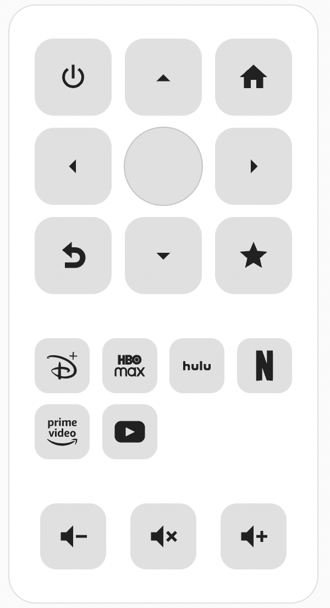

# EARLY RELEASE
This was designed to solve a personal need and I'm now trying to prepare it for others to use. That means several things can break between releases.

# polr-android-tv-remote-card
A Lovelace card designed as a companion to the [Android TV Remote](https://www.home-assistant.io/integrations/androidtv_remote/) integration.

## Installation

### Manually
1. Copy `polr-android-tv-remote-card.js` into your `<config>/<www>` folder
2. Add `polr-android-tv-remote-card.js` as a dashboard resource.


### HACS

1. Open the HACS section of Home Assistant.
2. Click the "..." button in the top right corner and select "Custom Repositories."
3. In the window that opens paste this Github URL.
4. Select "Lovelace"
5. In the window that opens when you select it click om "Install This Repository in HACS"

## Usage
### Settings
| Field | Required| Description |
| - | -| - |
| entity_id | yes | Android TV entity_id |
| apps | no | List of apps to show in remote. See below for supported apps. |

### Supported apps
| App | Value |
| - | - |
| Disney Plus | `disneyplus` |
| HBO Max | `hbomax` |
| Netflix | `netflix` |
| Amazon Prime | `prime` |

### Example
```
type: custom:polr-android-tv-remote-card
entity_id: remote.android_tv_remote
apps:
    - disneyplus
    - hbomax
    - netflix
    - prime
```
### Screenshot
<p align="center">
  
</p>