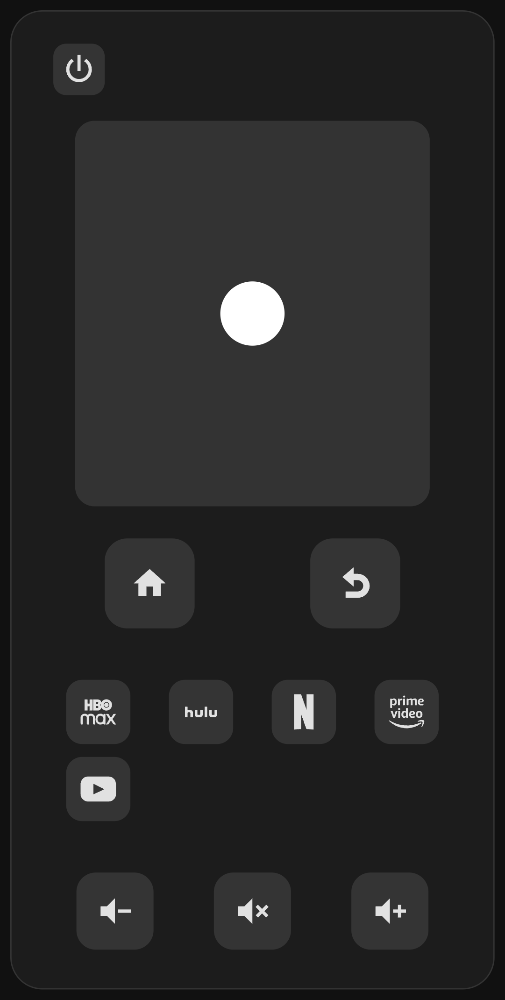

# polr-android-tv-remote-card

A Lovelace card designed as a companion to the [Android TV Remote](https://www.home-assistant.io/integrations/androidtv_remote/) integration.

## Installation

### HACS

[](https://my.home-assistant.io/redirect/hacs_repository/?repository=polr-android-tv-remote-card&category=Lovelace&owner=pathofleastresistor)

1. Open the HACS section of Home Assistant.
2. Click the "..." button in the top right corner and select "Custom Repositories."
3. In the window that opens paste this Github URL.
4. Select "Lovelace"
5. In the window that opens when you select it click om "Install This Repository in HACS"

### Manually

1. Copy `polr-android-tv-remote-card.js` into your `<config>/<www>` folder
2. Add `polr-android-tv-remote-card.js` as a dashboard resource.

## Usage

### Settings

<table>
    <tr>
        <th>Field</th>
        <th>Required</th>
        <th>Examples</th>
        <th>Description</th>
    </tr>
    <tr>
        <td>entity__id</td>
        <td>yes</td>
        <td>
            <pre>
entity_id: remote.atvremote
            </pre>
        </td>
        <td>Must be a remote entity created by the new Android TV integration</td>
    </tr>
    <tr>
        <td>apps</td>
        <td>no</td>
        <td>
<pre>
apps:
  - disneyplus
  - icon: mdi:youtube
    url: https://www.youtube.com
</pre>
        </td>
        <td>Must be a remote entity created by the new Android TV integration</td>
    </tr>
    <tr>
        <td>volume</td>
        <td>no</td>
        <td>
            <pre>
volume: false
            </pre>
        </td>
        <td>Must be a remote entity created by the new Android TV integration</td>
    </tr>
</table>

### Supported apps

| App          | Value        |
| ------------ | ------------ |
| Disney Plus  | `disneyplus` |
| HBO Max      | `hbomax`     |
| Netflix      | `netflix`    |
| Amazon Prime | `prime`      |

### Custom apps

If the app you want isn't supported, you can still add it by including a `icon` and `url` in the `apps` array.

### Example

```
type: custom:polr-android-tv-remote-card
entity_id: remote.android_tv_remote
apps:
    - disneyplus
    - hbomax
    - netflix
    - prime
    - icon: mdi:youtube
      url: https://www.youtube.com
```

### Screenshot

<p align="center">
  
</p>
