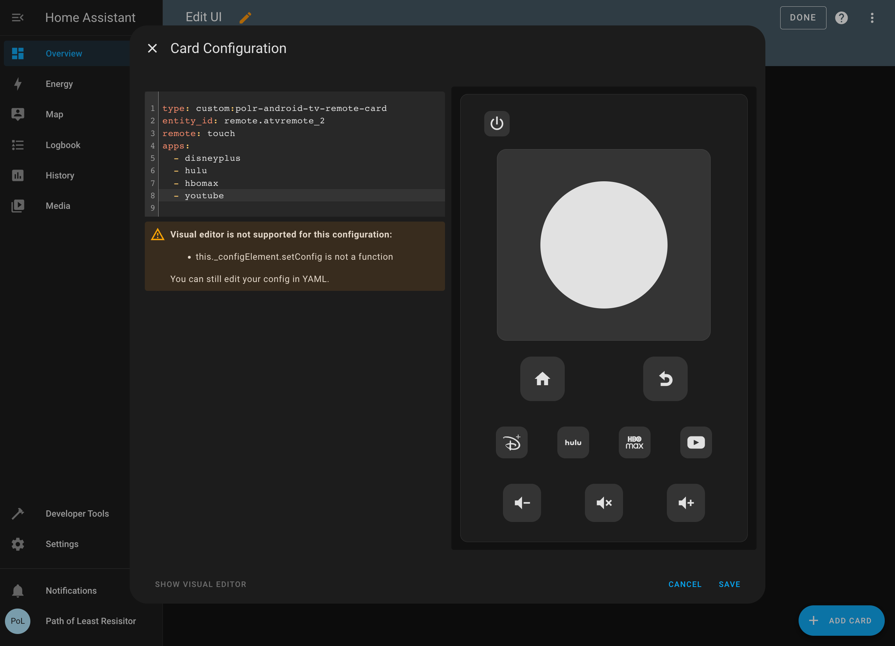

# PoLR Android TV Remote

`polr-android-tv-remote-card`

A Lovelace remote for the
[Android TV Remote](https://www.home-assistant.io/integrations/androidtv_remote/)
integration — with live state, an app launcher, and a visual editor.

The integration gives every TV two entities: a `remote` and a `media_player`.
This card uses both, so it can show whether the set is on, what app is running
and whether it is muted, rather than firing commands blind.

- Three pad styles — buttons, d-pad, touchpad
- Now-playing header, power, transport, volume and mute, all reflecting real
  state and hidden when the TV does not support them
- App launcher you configure in the UI, with six bundled brand logos
- Type into search boxes on the TV instead of pecking with the d-pad
- Hold to repeat, haptics, full keyboard and screen-reader support
- Every button can still be overridden to call any action

> **Upgrading from v1?** Your existing YAML keeps working unchanged. See
> [Migrating from v1](#migrating-from-v1).

## Installation

### HACS

[](https://my.home-assistant.io/redirect/hacs_repository/?repository=polr-android-tv-remote-card&category=Lovelace&owner=pathofleastresistor)

1. HACS → the ⋮ menu → **Custom repositories**
2. Paste this repository's URL, choose **Lovelace**, and install.

### Manually

1. Copy `dist/polr-android-tv-remote-card.js` into `<config>/www/`.
2. Add it as a dashboard resource (Settings → Dashboards → ⋮ → Resources).

## Usage

Add the card from the picker and configure it in the UI. The minimum config is
one entity:

```yaml
type: custom:polr-android-tv-remote-card
entity: remote.living_room_tv
```

A fuller example:

```yaml
type: custom:polr-android-tv-remote-card
entity: remote.living_room_tv
pad: touchpad
show_text_input: true
apps:
  - name: Netflix
    icon: brand:netflix
    action:
      action: activity
      activity: https://www.netflix.com/title
  - name: Plex
    icon: mdi:plex
    action:
      action: service
      service: script.movie_night
```

### Options

| Option                | Default  | Description                                                                 |
| --------------------- | -------- | --------------------------------------------------------------------------- |
| `entity`              | required | A `remote` entity from the Android TV Remote integration.                    |
| `media_player_entity` | auto     | Its paired media player. Found automatically; set it only to override.       |
| `volume_entity`       | player   | What the volume buttons drive. See [Volume](#volume).                        |
| `name`                | entity   | Header title.                                                                |
| `pad`                 | buttons  | `buttons`, `dpad` or `touchpad`.                                             |
| `show_header`         | `true`   | Now-playing tile with power.                                                 |
| `show_power`          | `true`   | Power button in the header.                                                  |
| `show_nav`            | `true`   | The pad itself.                                                              |
| `show_transport`      | `true`   | Previous, rewind, play-pause, fast-forward, next.                            |
| `transport_buttons`   | all five | Which transport buttons to draw, in order.                                   |
| `show_volume`         | `true`   | Volume down / mute / up, plus a level bar where there is one.                |
| `show_text_input`     | `false`  | Type text on the TV. See [Text input](#text-input).                          |
| `show_apps`           | `true`   | The app launcher.                                                            |
| `show_section_labels` | `false`  | Small headings above sections.                                               |
| `apps`                | `[]`     | See [Apps](#apps).                                                           |
| `app_columns`         | `5`      | Most app buttons on one row before wrapping.                                 |
| `hold_repeat`         | `true`   | Hold a d-pad or volume button to repeat it.                                  |
| `haptics`             | `true`   | Haptic feedback (Companion app only).                                        |
| `overrides`           | `{}`     | See [Overriding buttons](#overriding-buttons).                               |

### Apps

Each app has an optional `name`, `icon` and `color`, plus an `action`:

```yaml
apps:
  - name: Netflix
    icon: brand:netflix
    action: { action: activity, activity: https://www.netflix.com/title }
```

`icon` accepts an MDI name (`mdi:netflix`), one of the bundled logos
(`brand:netflix`, `brand:disneyplus`, `brand:hbomax`, `brand:hulu`,
`brand:prime`, `brand:youtube`), or an image path or URL.

| `action`   | Fields     | What it does                                                              |
| ---------- | ---------- | ------------------------------------------------------------------------- |
| `activity` | `activity` | `remote.turn_on` with an app name from the integration, or a deep link.    |
| `app`      | `app_id`   | `media_player.play_media` with an Android package id. Needs a player.      |
| `key`      | `key`      | `remote.send_command` with a raw key code.                                 |
| `service`  | `service`, `data`, `target` | Calls any action at all.                                 |

The app row is `app_columns` columns wide, so a button is the same size whether
you have two apps or ten, and a sixth wraps onto a second row aligned with the
first.

Nothing can enumerate the apps installed on a TV — not this card, not the
integration. What the TV does report is the app running *right now*, so the
editor offers to capture that, which is the easiest way to learn a package id.
If you have configured apps in the integration itself (Settings → Devices &
Services → Android TV Remote → Configure), `activity` can be the app's name
instead of a deep link.

### Overriding buttons

Any button can be given Home Assistant's standard **interactions** — the same
tap / hold / double-tap config the tile card uses, with the full action
vocabulary (`perform-action`, `more-info`, `navigate`, `url`, `toggle`, `none`):

```yaml
overrides:
  volume_up:
    tap_action:
      action: perform-action
      perform_action: button.press
      target:
        entity_id: button.media_room_baton_volume_up
  power:
    hold_action:
      action: more-info
```

The editor uses HA's own interactions selector for the volume buttons.

Two shorthands are accepted for the common cases. A bare entity id, for anything
that can simply be pressed — `button`, `input_button`, `script`, `scene` or
`automation`:

```yaml
overrides:
  power: button.media_room_baton_power
```

…and v1's service-call shape, which becomes the tap action:

```yaml
overrides:
  power:
    service: remote.send_command
    data:
      command: power
      entity_id: remote.living_room_ir_repeater
```

Two things worth knowing:

- A `hold_action` **replaces hold-to-repeat** on that button. A control cannot
  both repeat while held and do something else.
- A `double_tap_action` delays every tap on that button by 250ms, because a tap
  is not known to be single until the window passes. That is why neither is
  wired unless you configure it.

Valid buttons: `up`, `down`, `left`, `right`, `center`, `power`, `home`, `back`,
`menu`, `favorite`, `volume_up`, `volume_down`, `volume_mute`, `play_pause`,
`next`, `previous`, `rewind`, `fast_forward`. The `favorite` button appears only
when it has an override.

Skip previous and next are hidden when the paired player does not advertise
them. Rewind, fast-forward and play/pause are key codes, so they are always
shown — hold rewind or fast-forward to seek continuously.

### Volume

Volume buttons always work — worst case they send key codes. Whether you can
*see* the volume is another matter: `androidtv_remote` only reports a level when
the TV itself handles audio. Hand the sound to a soundbar over ARC and there is
no level and no mute flag, so the card shows the three buttons and nothing else
rather than inventing a bar. Mute falls back to the `MUTE` key, which is a real
toggle, instead of `media_player.volume_mute`, which is absolute and would mute
every time.

If a soundbar or receiver exposes a media player, point the card at it:

```yaml
volume_entity: media_player.living_room_soundbar
```

The buttons then drive that entity, and its level and mute state come back.
Everything else still follows the TV.

**If volume goes through an IR bridge**, there is usually no media player at
all — instead you get one pressable entity per command. A Sofabaton X1S, for
instance, exposes `button.<name>_volume_up`, `_volume_down` and `_volume_mute`.
Point each button at its entity:

```yaml
overrides:
  volume_up: button.media_room_baton_volume_up
  volume_down: button.media_room_baton_volume_down
  volume_mute: button.media_room_baton_volume_mute
```

The editor has HA's interactions selector for each of these under **Volume**, so
you can also give them a hold or double-tap action. See
[Overriding buttons](#overriding-buttons).

### Scrolling on mobile

Buttons resolve on release, so you can start a scroll anywhere on a button and
it will not fire — it only presses if your finger lifts without travelling.

The touchpad is the exception. A swipe surface has to claim the gesture, so it
sets `touch-action: none` and the page will not scroll from it. It is kept short
with a gutter down each side to leave room to scroll past; if you would rather
not have the trade-off at all, use `pad: buttons` or `pad: dpad`.

### Text input

`show_text_input: true` adds a field that types on the TV, which beats entering
a search query with the d-pad. Two caveats, and the card can detect neither, so
it fails silently rather than showing a false error:

- Text only lands while a text field is **focused on the TV**.
- The device's config entry needs **Enable IME** turned on.

Test it first from Developer Tools → Actions with a search box open on the TV:

```yaml
action: remote.send_command
target: { entity_id: remote.living_room_tv }
data: { command: "text:the bear" }
```

### What the integration does not support

Worth knowing, because it shapes the card:

- **No app discovery.** The media player has no `source_list` and no
  `select_source`, and nothing enumerates what is installed on the TV.
  `activity_list` contains only the apps someone typed into the integration's
  Configure dialog. The one runtime signal is `app_id` for whatever is on
  screen — the editor offers to capture that, which is the easiest way to learn
  an app's package id.
- **No volume setting.** It supports volume *steps* but not `volume_set`, so
  the level bar is read-only — and often absent entirely, see
  [Volume](#volume).
- **No media title or artwork.** Only the app name is reported. Both appear if
  you point `media_player_entity` at a different player on the same TV, such as
  a Chromecast.

## Migrating

### From a build of the `general-improvements` branch

That branch never reached HACS, but it was buildable, so some configs use its
keys. They are translated on load:

| Branch key      | v2                                                     |
| --------------- | ------------------------------------------------------ |
| `showRemote`    | `show_nav`                                             |
| `showApps`      | `show_apps`                                            |
| `showVolume`    | `show_volume`                                          |
| `showMedia`     | `show_transport`                                       |
| `showURLSearch` | `show_text_input`                                      |
| `media_controls`| `transport_buttons`                                    |
| `showBasic`     | dropped — back/home/menu is always drawn               |

### From v1

**Nothing to do.** v1 configs are translated on load, and the six brand
shortcuts launch exactly what they launched before. Opening the visual editor
rewrites the config to v2; if you never open it, your YAML stays as it is and
keeps working.

| v1                                      | v2                                              |
| --------------------------------------- | ----------------------------------------------- |
| `entity_id:`                            | `entity:`                                       |
| `remote: default`                       | `pad: buttons`                                  |
| `remote: touch`                         | `pad: touchpad`                                 |
| `remote: dpad`                          | `pad: dpad`                                     |
| `volume: false`                         | `show_volume: false`                            |
| `apps: [netflix]`                       | An app entry with `brand:netflix` and v1's link |
| `apps: [{icon, url}]`                   | `action: {action: activity, activity: url}`     |
| `apps: [{icon, service, data}]`         | `action: {action: service, …}`                  |
| `up:`, `down:`, `power:`, `favorite:` … | `overrides: {up: …}`                            |
| `volumeup:`, `volumedown:`, `volumemute:` | `overrides: {volume_up: …}` etc.              |

The pad is now purely directional. v1's default layout packed power, home,
back and favourite into the corners of the 3x3 grid; those live in the header
and the back/home/menu row instead, which is always shown.

Three v1 bugs are fixed rather than reproduced, so behaviour differs slightly:

- **Power now works without an override.** In v1 the power button did nothing
  at all unless you gave it one.
- **The favourite button no longer crashes.** v1 always drew it on the default
  pad and threw when pressed if it had no override. It now appears only when
  configured.
- **An unrecognised app name no longer breaks the card.** v1 threw while
  rendering; it is now treated as an activity, with a console warning.

## Development

```bash
npm install
npm run watch      # rebuild on save
npm test           # config migration + action layer
npm run typecheck
```

`test/harness/` renders the built bundle against a stubbed `hass` outside Home
Assistant, covering states that are awkward to reach in a live instance —
unavailable, no paired player, reduced `supported_features`. `node
test/harness/shoot.mjs` screenshots them all in light and dark and fails on any
console error.

## Screenshots

<p align="center">
  
</p>
