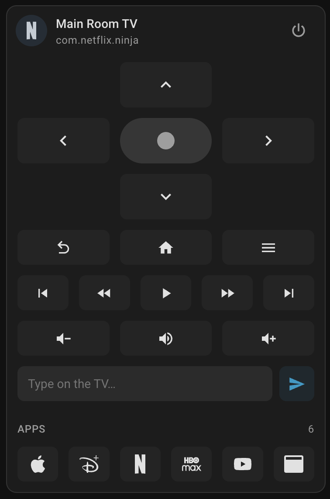

# PoLR Android TV Remote

A Lovelace remote for the
[Android TV Remote](https://www.home-assistant.io/integrations/androidtv_remote/)
integration — with live state, an app launcher, and a visual editor.

<p align="center">
  
</p>

The integration gives every TV two entities: a `remote` and a `media_player`.
This card uses both — pairing them automatically by device — so it can show
whether the set is on and what app is running, rather than firing commands blind.

- Three pad styles: buttons, d-pad, touchpad
- Now-playing header, power, transport and volume, reflecting real state and
  hiding what the device does not support
- An app launcher you configure in the UI, with six bundled brand logos
- Type into search boxes on the TV instead of pecking with the d-pad
- Hold to repeat, haptics, full keyboard and screen-reader support
- Any button can be pointed at any Home Assistant action

## Installation

### HACS

[](https://my.home-assistant.io/redirect/hacs_repository/?repository=polr-android-tv-remote-card&category=Lovelace&owner=pathofleastresistor)

HACS → ⋮ → **Custom repositories** → paste this repository's URL → **Lovelace**
→ install.

### Manually

Copy `dist/polr-android-tv-remote-card.js` into `<config>/www/` and add it as a
dashboard resource under Settings → Dashboards → ⋮ → Resources.

## Setting it up

**Use the visual editor.** Add the card, pick your remote entity, and everything
else has a control: which sections appear, which pad, which transport buttons,
what each app tile launches, and what power and volume do. The editor is
organised in the same order as the card — Header, Pad, Playback, Volume, Apps,
Text input, Advanced — so what you are changing is where you expect it.

Everything below documents the YAML the editor writes, for anyone who would
rather edit it directly or wants to see what a setting maps to. The only
required key is `entity`:

```yaml
type: custom:polr-android-tv-remote-card
entity: remote.living_room_tv
```

### Options

| Option                | Default  | Description                                                             |
| --------------------- | -------- | ----------------------------------------------------------------------- |
| `entity`              | required | A `remote` entity from the Android TV Remote integration.               |
| `name`                | entity   | Header title.                                                           |
| `show_header`         | `true`   | Now-playing tile with power.                                            |
| `show_power`          | `true`   | Power button — in the header, or in the back/home/menu row without one. |
| `show_nav`            | `true`   | The pad itself.                                                         |
| `pad`                 | buttons  | `buttons`, `dpad` or `touchpad`.                                        |
| `show_transport`      | `true`   | Previous, rewind, play-pause, fast-forward, next.                       |
| `transport_buttons`   | all five | Which of those to draw; they always render in playback order.           |
| `show_volume`         | `true`   | Volume down / mute / up, plus a level bar where there is one.           |
| `volume_entity`       | player   | What the volume buttons drive. See [Volume](#volume).                   |
| `show_text_input`     | `false`  | Type on the TV. See [Text input](#text-input).                          |
| `show_apps`           | `true`   | The app launcher.                                                       |
| `apps`                | `[]`     | See [Apps](#apps).                                                      |
| `sections`            | `[]`     | Your own rows of buttons. See [Sections](#sections).                    |
| `app_columns`         | `5`      | Most app buttons on one row before wrapping.                            |
| `show_section_labels` | `false`  | Small headings above sections.                                          |
| `hold_repeat`         | `true`   | Hold a d-pad or volume button to repeat it.                             |
| `haptics`             | `true`   | Haptic feedback (Companion app only).                                   |
| `overrides`           | `{}`     | See [Pointing buttons elsewhere](#pointing-buttons-elsewhere).          |

The back/home/menu row is always drawn.

### Apps

Add apps in the editor: pick from the six bundled brands, capture whatever is
playing on the TV right now, or build one by hand. Each has an optional `name`,
`icon` and `color`, plus an `action`:

```yaml
apps:
  - name: Netflix
    icon: brand:netflix
    action: { action: activity, activity: https://www.netflix.com/title }
```

`icon` takes an MDI name (`mdi:plex`), a bundled logo (`brand:netflix`,
`brand:disneyplus`, `brand:hbomax`, `brand:hulu`, `brand:prime`,
`brand:youtube`), or an image path or URL.

| `action`   | Fields                      | What it does                                                            |
| ---------- | --------------------------- | ----------------------------------------------------------------------- |
| `activity` | `activity`                  | `remote.turn_on` with an app name from the integration, or a deep link. |
| `app`      | `app_id`                    | `media_player.play_media` with an Android package id.                   |
| `key`      | `key`                       | `remote.send_command` with a raw key code.                              |
| `service`  | `service`, `data`, `target` | Calls any action at all.                                                |

Buttons stay the same size whatever the app count, and wrap after
`app_columns`.

### Sections

The app launcher is built in. Beyond it you can declare your own named rows of
buttons — for the things around the TV that the remote has no concept of.

A button takes the same `name`, `icon`, `color` and `action` as an app, plus an
optional **`entity`**: name one and the tile lights up while that entity is on,
using the same colour the header does. Name none and the tile is simply never
lit — the card will not claim to know a state it cannot see.

A real example. Turning this home theatre on is four controls: a hub activity, a
projector, a soundbar reachable only over IR, and the streamer itself. The
activity fires all of them, but IR is one-way, so a device can miss the command
or already be on and get toggled off — the tiles show which.

```yaml
show_section_labels: true
sections:
  - name: Home theater
    buttons:
      - name: Movie mode
        icon: mdi:theater
        entity: select.media_room_baton_activity   # lit unless the activity is "Off"
        action:
          action: service
          service: select.select_option
          target: { entity_id: select.media_room_baton_activity }
          data: { option: Google TV }

      - name: Projector
        icon: mdi:projector
        entity: media_player.projector_lsp9
        action: { action: service, service: media_player.toggle, target: { entity_id: media_player.projector_lsp9 } }

      - name: Soundbar          # IR only: no entity, so never lit
        icon: mdi:soundbar
        action:
          action: service
          service: remote.send_command
          data: { entity_id: remote.media_room_baton_remote, device: "3", command: 26 }
```

| Key       | Description                                                       |
| --------- | ----------------------------------------------------------------- |
| `name`    | Row heading. Shown only when `show_section_labels` is on.         |
| `columns` | Buttons per row. Defaults to `app_columns`.                       |
| `buttons` | Tiles, each as above plus an optional `entity`.                   |

A tile is lit unless its entity reads `off`, `unavailable`, `unknown`, `idle`,
`standby` or `none` — compared case-insensitively, which is what makes a `select`
work: its state is the literal option name, so `Off` is off and `Google TV` is on.

Sections render in the order you declare them, above the app launcher. A section
whose buttons are all malformed is dropped rather than drawn empty.

### Pointing buttons elsewhere

Any button can be given Home Assistant's standard **interactions** — the same
tap / hold / double-tap config the tile card uses, with the full action
vocabulary (`perform-action`, `more-info`, `navigate`, `url`, `toggle`, `none`).
The editor has HA's own interactions selector for **power** and the three volume
buttons, which are the ones people actually redirect; the rest are YAML.

```yaml
overrides:
  power:
    tap_action:
      action: perform-action
      perform_action: remote.send_command
      data:
        command: power
        entity_id: remote.living_room_rf
    hold_action:
      action: more-info
```

Two shorthands are accepted. A bare entity id, for anything that can simply be
pressed — `button`, `input_button`, `script`, `scene` or `automation`:

```yaml
overrides:
  power: button.blaster_power
```

…and a plain service call, which becomes the tap action:

```yaml
overrides:
  home: { service: script.tv_home }
```

Valid buttons: `up`, `down`, `left`, `right`, `center`, `power`, `home`, `back`,
`menu`, `favorite`, `volume_up`, `volume_down`, `volume_mute`, `play_pause`,
`next`, `previous`, `rewind`, `fast_forward`. `favorite` appears only when it
has an override.

Worth knowing:

- **Power** toggles when it has no override, choosing `turn_on` or `turn_off`
  from the current state. With one, it always performs your action — which is
  what a blaster sending a single toggle code needs.
- A **`hold_action` replaces hold-to-repeat** on that button. A control cannot
  both repeat while held and do something else.
- A **`double_tap_action` delays every tap** on that button by 250ms, because a
  tap is not known to be single until the window passes. Neither is wired unless
  you configure it.

### Volume

The volume buttons always work — worst case they send key codes. Whether you can
*see* the volume is another matter: `androidtv_remote` only reports a level when
the TV itself handles the audio. Hand the sound to a soundbar over ARC and there
is no level and no mute flag, so the card shows three buttons and nothing else
rather than inventing a bar. Mute then falls back to the `MUTE` key, which is a
real toggle, instead of `media_player.volume_mute`, which is absolute and would
mute every time.

If a soundbar or receiver exposes a media player, point the card at it:

```yaml
volume_entity: media_player.living_room_soundbar
```

If volume goes through an **IR bridge**, there is usually no media player at all
— instead you get one pressable entity per command. A Sofabaton X1S, for
instance, exposes `button.<name>_volume_up`, `_volume_down` and `_volume_mute`:

```yaml
overrides:
  volume_up: button.media_room_baton_volume_up
  volume_down: button.media_room_baton_volume_down
  volume_mute: button.media_room_baton_volume_mute
```

### Text input

`show_text_input: true` adds a field that types on the TV, which beats entering
a search query with the d-pad. Two caveats, and the card can detect neither, so
it fails silently rather than showing a false error:

- Text only lands while a text field is **focused on the TV**.
- The device's config entry needs **Enable IME** turned on.

Test it from Developer Tools → Actions with a search box open on the TV:

```yaml
action: remote.send_command
target: { entity_id: remote.living_room_tv }
data: { command: "text:the bear" }
```

### Scrolling on mobile

Buttons resolve on release, so you can start a scroll anywhere on one and it
will not fire. The touchpad is the exception: a swipe surface has to claim the
gesture, so the page will not scroll from it. It is kept short with a gutter
down each side to leave room to scroll past; `pad: buttons` or `pad: dpad`
avoids the trade-off entirely.

### What the integration does not support

Worth knowing, because it shapes the card:

- **No app discovery.** The media player has no `source_list` and no
  `select_source`, and nothing enumerates what is installed on the TV. The one
  runtime signal is the app on screen right now — the editor offers to capture
  that, which is the easiest way to learn a package id.
- **No volume setting.** Volume *steps* work, `volume_set` does not, so the
  level bar is read-only and often absent — see [Volume](#volume).
- **No media title or artwork.** Only the app name is reported.

## Migrating

**Nothing to do.** Old configs are translated on load, and the six brand
shortcuts launch exactly what they launched before. Opening the visual editor
rewrites the config; if you never open it, your YAML stays as it is and keeps
working.

| Old                                       | Now                                            |
| ----------------------------------------- | ---------------------------------------------- |
| `entity_id:`                              | `entity:`                                      |
| `remote: default` / `touch` / `dpad`      | `pad: buttons` / `touchpad` / `dpad`           |
| `volume: false`                           | `show_volume: false`                           |
| `apps: [netflix]`                         | An app entry with `brand:netflix` and its link |
| `apps: [{icon, url}]`                     | `action: {action: activity, activity: url}`    |
| `apps: [{icon, service, data}]`           | `action: {action: service, …}`                 |
| `up:`, `power:`, `favorite:` …            | `overrides: {up: …}`                           |
| `volumeup:`, `volumedown:`, `volumemute:` | `overrides: {volume_up: …}` etc.               |
| `showRemote` / `showApps` / `showVolume`  | `show_nav` / `show_apps` / `show_volume`       |
| `showMedia` / `showURLSearch`             | `show_transport` / `show_text_input`           |
| `media_controls`                          | `transport_buttons`                            |
| `showBasic`                               | dropped — back/home/menu is always drawn       |

The pad is now purely directional. The old default layout packed power, home,
back and favourite into the corners of the 3×3 grid; those live in the header
and the back/home/menu row instead.

Three old bugs are fixed rather than reproduced, so behaviour differs slightly:

- **Power works without an override.** It previously did nothing at all unless
  you gave it one.
- **The favourite button no longer crashes** when pressed unconfigured. It now
  appears only when it has an override.
- **An unrecognised app name no longer breaks the card.** It is treated as an
  activity, with a console warning.

## Development

```bash
npm install
npm run watch        # rebuild on save
npm test             # config migration, actions and the device layer
npm run typecheck
npm run shots        # render in a real browser; screenshots and behaviour checks
npm run lint:exports # exports nothing imports
```

`test/harness/` renders the built bundle against a stubbed `hass` outside Home
Assistant, covering states that are awkward to reach in a live instance —
unavailable, no paired player, reduced `supported_features`. `npm run shots`
screenshots them in light and dark and fails on any console error, on a tap that
does not fire, on a scroll that does, and on a control that is unlabelled or
unreachable by keyboard.
